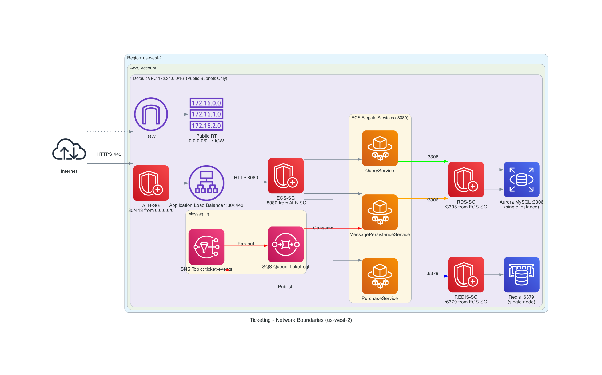

# High-Concurrency Ticketing Platform - CQRS Architecture

A high-performance ticketing system built with CQRS pattern, implementing read-write separation and event-driven architecture using AWS services.

## Table of Contents
- [Architecture Overview](#architecture-overview)
- [Services](#services)
- [API Documentation](#api-documentation)
- [Deployment](#deployment)
- [Troubleshooting](#troubleshooting)

## Architecture Overview


### CQRS Pattern Implementation

Structure is related to the Project "High-Concurrency-CQRS-Ticketing-Platform" with adjustments according to AWS services. 
- Kafka --> SNS + SQS
- Redis in Elasticache
- MySQL in RDS Aurora MysQL

This system implements Command Query Responsibility Segregation (CQRS) with event-driven architecture:

```
Ticket Purchase Request → PurchaseService (Redis seat locking + SNS event publishing)
                              ↓
                    Amazon SNS Topic → SQS Queue
                              ↓
                   SqsConsumer (async MySQL write)
                              ↓
                   QueryService (MySQL data read)
```

### Technology Stack
- **Java 21** + **Spring Boot 3.x**
- **MySQL 8.x** (primary data store)
- **Redis 7.x** (seat state caching)
- **AWS SNS/SQS** (event messaging)
- **Docker** (containerization)
- **Terraform** (infrastructure as code)

### Service Architecture

| Service | Port | Responsibility | Technologies |
|---------|------|----------------|--------------|
| **PurchaseService** | 8080 | Handle ticket purchases, seat locking, event publishing | Redis + SNS |
| **QueryService** | 8081 | Provide ticket query and analytics APIs | MySQL + JPA |
| **MessagePersistenceService** | N/A | Consume events and persist data to MySQL | SQS + MySQL |

### Infrastructure Components

| Component | Purpose | Configuration |
|-----------|---------|---------------|
| **Application Load Balancer (ALB)** | HTTP routing with path-based rules | Routes `/purchase*`, `/query*`, `/events*` to respective services |
| **ECS Auto Scaling** | Dynamic task scaling based on CPU | purchase-service: 3-6 tasks (CPU > 60%), query/consumer: 1-3 tasks (CPU > 70%) |
| **MySQL (RDS Aurora)** | Primary data persistence | Aurora cluster: 1 writer + 1 reader replica (db.t4g.medium) |
| **Redis (ElastiCache)** | Seat state caching and distributed locks | Single-node cluster (cache.t3.small) |
| **AWS SNS/SQS** | Event publishing and async consumption | SNS: ticket-events topic, SQS: ticket-sql queue |

**Load Balancing**: ALB distributes traffic across ECS tasks with health checks  
**Auto Scaling**: Purchase service maintains 3-6 tasks (scales at CPU > 60%), Query/Consumer maintain 1-3 tasks (scale at CPU > 70%)  
**Database HA**: Aurora provides automatic failover from writer to reader replica

## Services

| Service | Port | Responsibility | Key Technologies | Main Features |
|---------|------|----------------|------------------|---------------|
| **PurchaseService** | 8080 | Write operations - ticket purchases | Spring Boot, Redis, SNS | Redis seat locking, SNS event publishing, Input validation |
| **QueryService** | 8081 | Read operations - ticket queries | Spring Boot, JPA, MySQL | Multi-dimensional queries, Revenue analytics, Optimized reads |
| **MessagePersistenceService** | N/A | Event consumption & data projection | Spring Boot, SQS, MySQL | Async processing, Transactional consistency, Dead letter handling |

## API Documentation

**Base URL**: `http://<alb-dns-name>` (Get from: `terraform output -raw alb_dns_name`)

**Complete API Reference**: See `Ticketing-System-API-Tests.postman_collection.json` for full Postman collection.

### Quick Reference

#### Purchase Service (`/purchase/*`)
```bash
# Purchase a ticket
POST /purchase/api/v1/tickets
Body: {"venueId":"Venue1","eventId":"Event1","zoneId":1,"row":"A","column":"1"}

# Health check
GET /purchase/health
```

#### Query Service (`/query/*`)
```bash
# Get all tickets
GET /query/api/v1/tickets

# Get ticket by ticket ID (UUID)
GET /query/api/v1/tickets/{ticketId}
# Example: GET /query/api/v1/tickets/5b15a8a4-1f84-44dd-8f3d-9ae9de6e6d1b

# Get ticket count for event
GET /query/api/v1/tickets/count/{eventId}
# Example: GET /query/api/v1/tickets/count/Event1

# Get revenue for venue and event
GET /query/api/v1/tickets/revenue/{venueId}/{eventId}
# Example: GET /query/api/v1/tickets/revenue/Venue1/Event1

# Health check
GET /query/health
```

#### Message Persistence Service (`/events/*`)
```bash
# Health check (monitoring only)
GET /events/health
```

### Testing Example

```bash
# Get ALB URL
ALB_URL=$(cd config/terraform && terraform output -raw alb_dns_name)

# Purchase a ticket
curl -X POST http://$ALB_URL/purchase/api/v1/tickets \
  -H "Content-Type: application/json" \
  -d '{"venueId":"Venue1","eventId":"Event1","zoneId":1,"row":"A","column":"1"}'

# Query all tickets (wait 2s for async processing)
sleep 2 && curl http://$ALB_URL/query/api/v1/tickets
```

## Deployment

### Prerequisites
- AWS CLI v2 configured with credentials
- Terraform 1.6+
- Docker Desktop
- jq (JSON processor)

### Deployment Steps

#### 1. Configure Terraform Variables
```bash
cd config/terraform
cp terraform.tfvars.template terraform.tfvars
nano terraform.tfvars  # Edit: aws_region, aws_account_id, project_name, environment
```

#### 2. Configure AWS Credentials
```bash
# For AWS Learner Lab users:
aws configure set aws_access_key_id YOUR_ACCESS_KEY
aws configure set aws_secret_access_key YOUR_SECRET_KEY
aws configure set aws_session_token YOUR_SESSION_TOKEN
aws configure set region us-west-2

# Verify
aws sts get-caller-identity
```

#### 3. Grant Script Permissions
```bash
chmod +x config/scripts/build-and-push.sh
chmod +x config/scripts/check-infrastructure.sh
```

#### 4. Create Infrastructure
```bash
cd config/terraform
terraform init
terraform apply -auto-approve
```

**Creates**: VPC, ECR (3 repos), RDS Aurora MySQL, ElastiCache Redis, SNS, SQS, ALB, ECS Fargate, Secrets Manager, CloudWatch

** Expected Time**: ~10-15 minutes (RDS Aurora and ElastiCache initialization are the slowest)

#### 5. Build & Deploy Services
```bash
cd config/scripts
./build-and-push.sh
```
---

### Deployment Flow
```
terraform.tfvars → aws configure → chmod +x → terraform apply → ./build-and-push.sh
```

---

### Verification
```bash
# Wait 3-5 minutes after build-and-push.sh completes, then verify:
./config/scripts/check-infrastructure.sh

# Check service health endpoints
ALB_URL=$(cd config/terraform && terraform output -raw alb_dns_name)
curl http://$ALB_URL/purchase/health
curl http://$ALB_URL/query/health
curl http://$ALB_URL/events/health
```

**Note**: If health checks fail initially, wait another 2-3 minutes for containers to fully initialize.

### Update Services
```bash
# After making code changes, rebuild and redeploy
cd config/scripts
./build-and-push.sh
```

**Note**: The script uses the current git commit SHA as the image tag. If you want to track changes, commit before deploying:
```bash
cd config/scripts && ./build-and-push.sh
```

### Cleanup
```bash
cd config/terraform
terraform destroy -auto-approve
```


